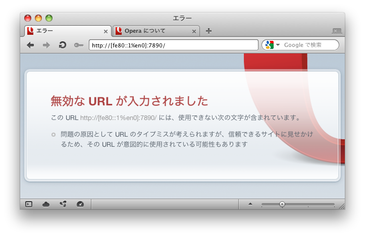

=====
ESD21
=====

-  IPv6の影響範囲とIPv6で感じるジェネラリストの必要性

  - 2011年12月17日

  - 於 持続可能なモノづくり・人づくり支援協会

  - 高野光弘 /  @takano32 <tak at no32.tk>

----

自己紹介
--------

.. image:: takano32.jpg
  :align: left

@takano32 a.k.a. 高野光弘

- グリー株式会社 開発本部 インフラ統括部

  - サーバ群を指揮するようなツールとか作ってます

- 日本UNIXユーザ会

  - 同年代から「暗黒UNIXおじさん」と呼ばれる

- Rubyコミッタ / IA-64メンテナ

  - 前職ではIA-64やAMD64やIntel64を対象にした仮想計算機機構の開発

----

お前、誰よ
----------

sinsai.info
^^^^^^^^^^^

.. image:: sinsai.info_logo.png

開発リーダー
^^^^^^^^^^^^

.. image:: sinsai.info_staff.png

 
協賛

.. image:: sinsai.info_footer.png

----

開発経験のあるプロダクトなど
----------------------------

- Smalltalk言語処理系

  - BREWプラットフォーム向け .NET VM の開発

- ギャザリング電子商取引サイト

  - 雑多なページのほか、クレジットカードの与信など

- 弁理士向けポータルサイトの開発

  - 検索機構や他サイトからのニュース引用の機能

- 企業向けメッセンジャー

  - SIPによる呼応制御やサーバサイドの実装

  - クライアントのビデオチャット機能なども担当

- ブレードサーバ向け仮想化機構の開発

- 大規模インフラストラクチャのメンテナンス

わりといろいろやってる (；´Д｀)

----

今日のアジェンダ
----------------
IPv6の暗黒面とかの話をします

- ネットワーク屋の常識とソフトウェア屋の常識

  - 剥離がおそろしい

  - いまIPv4でできてることができなくなるよ

  - ソフトウェアエンジニアが「ギャー」ってなる例とか紹介します

- IPv6の仕様については最低限しか触れません

  - 対象者は「IPv4のグローバルアドレスなくなることは知っている」くらいから

ヤバイよ、という概要説明するカンジ

----

現状の説明
----------

#. インターネットの仕組みを考えたひとたちは賢い

   - 割と予想していなかった規模まで耐えちゃってる

#. TCP/IP, UDP/IP がおまけとしてついてくる状況になり爆発的にインターネットが普及

   - Windows 95 の発売などが大きい

   - その以前まではパソコン通信などが主流のコミュニケーション手段

#. インターネットの仕組みを考えていた時代には考えられない問題が多発

   - 最たるものがIPv4アドレスの枯渇

次期にIPv6というものに置き換わることが予想されている

IPv6を推進する団体ではすでに普及した後に発生する問題を予想したりなどしている

----

復習: インターネットの恐ろしさ
------------------------------

IPv6の前にIPv4もコワイですよ

ex. 127.0.0.1 / ループバックアドレス ← 「オレの家」みたいな意味

- 自身のIPアドレスであるらしい

  - 「みんなそう指定してるから指定してる」でしょ？

- それ正しいんです
  
  - 由来は慣習的

  - ループバックさせている実現方法はさまざま

- 現在では 127.0.0.0/8 という説が有力

  - つまり、 127.x.y.z でよいという説が有力

ウンチクはそこらへんにしておいて、どうなってるんだろうね

----

Linux 2.6.27.39 ia64 GNU/Linux
------------------------------

適当なカーネルとプロトコルスタック選んだけどたぶんどれも同じなのでは

::

  takano32% uname -srmo
  Linux 2.6.27.39 ia64 GNU/Linux
  takano32% ping -c 3 127.16.32.64
  PING 127.16.32.64 (127.16.32.64) 56(84) bytes of data.
  64 bytes from 127.16.32.64: icmp_req=1 ttl=64 time=0.038 ms
  64 bytes from 127.16.32.64: icmp_req=2 ttl=64 time=0.009 ms
  64 bytes from 127.16.32.64: icmp_req=3 ttl=64 time=0.008 ms
  
  --- 127.16.32.64 ping statistics ---
  3 packets transmitted, 3 received, 0% packet loss, time 2013ms
  rtt min/avg/max/mdev = 0.008/0.018/0.038/0.014 ms

- 有力な説の 127.0.0.0/8 を採用

----

Darwin 11.0.0 x86_64 Darwin
---------------------------

Mac OS Xのカーネルとプロトコルスタックですね

自己満足のために Lion 使いました

::

  takano32% uname -srmo
  Darwin 11.0.0 x86_64 Darwin
  takano32% ping -c 3 127.16.32.64
  PING 127.16.32.64 (127.16.32.64): 56 data bytes
  Request timeout for icmp_seq 0
  Request timeout for icmp_seq 1
  
  --- 127.16.32.64 ping statistics ---
  3 packets transmitted, 0 packets received, 100.0% packet loss

- **100.0% packet loss** ...

  - おそらく実装は美しい
    
  - 余計なことをせずに /etc/hosts に書いてあるので分かりやすい

----

まとめ: インターネットの恐ろしさ
--------------------------------

- インターネットはカオス

  - よくわかんないのになんか動いてる部分たくさん

  - 日常的に使ってるものさえもよくわからない

- **さらによくわかんないIPv6** というものがやってくる

  - IPv6 では ::1 がループバックアドレスと明示されてるけどね

  - 書き忘れたけど、IPv4の不便なところたくさん解消されてる

    - アドレスの枯渇の解消とかはその一部

    - フラグメント化のムダの排除とかARP spoofingの対策とかも入ってる

でも、こっから先はIPv6の暗黒面

**IPv6右翼の方は可及的速やかに聞かないフリをしてください**

----

アドレス表記
------------

ex. リンクローカルアドレス

- IPv4ではよくわかんないが勝手に 169.254.0.0/16 とか割り当てるやつの正式名称

  - 職場でとなりのコンピュータが何もしてないのに見えたりするのはこのおかげ

- IPv6ではメインの通信というより、アドレスの自動設定や近隣探索に利用
  
   - 「プライベートアドレス」の利用が氾濫し、現状と変化しない使い方を懸念
  
   - 「プライベートアドレス」という概念は現在では廃止されている

- とりあえずIPv6機構が有効になっていれば単一のマシンで使える

  - Mac とかなら手元で ifconfig すればすぐに使える

  - 今回はこのアドレスを例にアドレス表記などについておさらい

----

コラム：ネットワーク屋の主張
----------------------------

リンクローカルアドレスは必要ない？

- DNSでAAAAを引けば生のアドレス打たなくていいじゃーん

  - DNSというシステムを使うと人間が読みやすい文字列が機械が扱いやすいアドレスになる

- 問題が起きないっていうデータの裏付けも取れてるよ！

  - ex. World IPv6 Day

  - 世界的に著名なサイトがIPv6でも閲覧できることを実証

でも、それはユーザの視点。開発者はヤバイ。

192.168.32.16 みたいなアドレス使えないと困るよね。

使えない裏付けも紹介します。

----

技術者が使わなければならない理由
--------------------------------
開発環境と同程度のレベルが想定される家庭内LANでの実情

.. image:: JANOG26.png

----

技術者が使わなければならない理由
--------------------------------

----

技術者が使わなければならない理由
--------------------------------

----

技術者が使わなければならない理由
--------------------------------

----

技術者が使わなければならない理由
--------------------------------

----

技術者が使わなければならない理由
--------------------------------

----

ほとんど何も決まってない！！！
------------------------------

----

技術者が使わなければならない理由
--------------------------------

.. image:: post-v6homegw-kitaguchi-0.jpg

----

技術者が使わなければならない理由
--------------------------------

----

技術者が使わなければならない理由
--------------------------------

----

技術者が使わなければならない理由
--------------------------------

----

技術者が使わなければならない理由
--------------------------------

.. image:: post-v6homegw-kitaguchi-10.jpg

----

やっぱり何も決まってない！！！
------------------------------

----

World IPv6 Day は特別な状況下で成功しただけ！！！
-------------------------------------------------

----

アドレス表記 (Contd.)
---------------------

アドレス表記のおさらい

- IPv4 リンクローカルアドレス

  - 169.254.0.0/16

- IPv6 リンクローカルアドレス

  - fe80::/10

    - ex. fe80::C0FF:EE

    - 続きはRFC 1884で

- ところで、みなさん http://192.168.32.16/ とかアクセスしますよね

  - IPv6ではどう書くんでしょうか？

    - 基本はサイトローカルアドレスと同じです

    - see also RFC 5156 `2.3. IPv4-Compatible Addresses`

----

アドレス表記 (Contd.)
---------------------

正解とポイント

- http://[fe80::01%en0]:8080/

  - コロン区切り表記に由来してポート番号がわからなくなるので [] が必要

  - インターフェイスを指定しないと行き先がわかんない / 続きはRFC 1884で

- ゾーンの扱いが難しい / ゾーンというのは上記では `en0` の部分

  - **ゾーンを指定しないと行き先が分からない**

  - **コマンドによってゾーンの扱いはことなる**

- ブラウザだとインターフェース指定がない

 - 起動するたびに **-i eth0** とか指定するブラウザがあったらキモイ

 - http://[fe80::01%en0]:8080/ のようなURL指定になる

 - **そんな不思議なURLで大丈夫か？**

----

実際にやってみた
----------------

ex. wget

::

  takano32% wget -6 -O - 'http://[fe80::1%en0]:7890/'
  http://[fe80::1%en0]:7890/: IPv6 アドレスが不正です.

- なんか認識してるけど、ゾーン（%en0）がパースできてないっぽい

ex. w3m

::

  takano32% w3m -6 -dump 'http://[fe80::1%en0]:7890/'
  w3m: Can't load http://[fe80::1%en0]:7890/.

- パースはちょっとがんばった！でも、なんでかムリ！！！

  - ソース読んでないので理由はわかんない

とりあえず、'RFC 4007 11.2.  The <zone_id> Part' などは現状 **ガン無視っぽい** 

ほかのHTTP User Agentの様子気になりますよね？

----

User Agentのまとめ
------------------

================ ====================================
User Agent       IPv6 linklocal address Ready?
================ ====================================
wget             NG
w3m              NG
Lynx             OK!
================ ====================================

- 意外だったのは w3m vs. Lynx

  - w3mのほうがユーザ数多い気がする
    
  - メンテナも多い気がする

  - それ以上に国産！

    - IPv6には日本からかなりのコミットがある

  - Lynxのほうは元から仕様に忠実な実装してたのかなぁ？

とりあえず、 **よくわかんないことはわかった**

はい、つぎの User Agent いきましょう

----

User Agentのまとめ 2.0
----------------------

================ ====================================
User Agent       IPv6 linklocal address Ready?
================ ====================================
Opera  11.50     NG
Chrome dev       NG
Chrome canary    NG
Firefox 5.0.1    OK!
================ ====================================

- Firefoxがんばってる

  - 探すと Host: ヘッダーに関する議論もフォーラムでしてる

- Chr*meェ・・・

  - IPv6にしても困らないって声を大にして言ってるところのブラウザ

  - なんだよ、ウソじゃん、困るやんけ・・・

もはや **疑心暗鬼になるレベル**

----

不正なアドレス 2.0
------------------

ネットワーク屋が得意なプロトコルスタックを改修してもムダ。

ソフトウェア屋の対応が必要。 レイヤーが複雑なWebアプリケーションは悲惨。

----

ex. PHP powered by Zend Engine
------------------------------

我らがPHPでURIをパースしてみた

::

  takano32% php -v
  PHP 5.3.6 (cli) (built: Jun  3 2011 16:17:53) (DEBUG)
  Copyright (c) 1997-2011 The PHP Group
  Zend Engine v2.3.0, Copyright (c) 1998-2011 Zend Technologies

::

  takano32% php -r 'var_dump(parse_url("http://[fe80::1%en0]:7890/"));'
  array(4) {
    ["scheme"]=>
    string(4) "http"
    ["host"]=>
    string(13) "[fe80::1%en0]"
    ["port"]=>
    int(7890)
    ["path"]=>
    string(1) "/"
  }

- ソース読んでないけど、これは実装が適当すぎる例ですね

  - host は [] が取り除かれないと他の用途で使えません

----

ex. Sinatra powered by Ruby
---------------------------

Sinatra / sinatra / lib / sinatra / base.rb

  https://github.com/sinatra/sinatra/blob/master/lib/sinatra/base.rb

:: 

  takano32% date
  Tue Jul 26 23:45:54 JST 2011

たぶん今も同じコード

.. code-block:: ruby

    set :run, false                       # start server via at-exit hook?
    set :running, false                   # is the built-in server running now?
    set :server, %w[thin mongrel webrick]
    set :bind, '0.0.0.0'
    set :port, 4567

えっ・・・ちょっとなんかすごいのがチラついた・・・

.. code-block:: ruby

    set :bind, '0.0.0.0'

IPv6というものは **アウト・オブ・眼中** という例

- IPv4の10進数表記をやめて、 set :bind, nil で対応できる

- っていうか、 **放置してればIPv6でも使えるのに** 余計なことしてる・・・

----

FAQ
---

なんであなたはチケット切ったり修正しないんですか

- 私はクラウドシステムのようにスケールしません...orz

  - 可能な範囲では修正などを促したりしています

- 影響プロダクトが無数

  - FTPとかもNAPTで影響がありそう

    - おそらく ip_conntrack_ftp と ip_nat_ftp という箇所などで不整合
      
    - FTPとかソフトウェア屋にとってはロストテクノロジー
        
    - でも各所のWebデザインが「ギャー」するのかなー

- Rubyまわりくらいは余裕があればなおします

  - Rubyは処理系周りのコミット権あるし、折衝しやすい

現実的に現段階で効果的なのは啓蒙活動くらい

----

まとめ
------

- **どのレイヤーで問題が起こるかわからない** ので、必要なときには専門外のソースコードにもダイブする勇気を

- 同じ問題意識を共有し、世界のサービスが「ギャー」ってならないといいですね！

  - そして、余裕があれば啓蒙活動をしましょう

- 今回の例は氷山の一角でIPv6が広く使われはじめたら何が起こるか分かりません

  - ネットワーク屋が言う「動く」を真に受けすぎるとやられる可能性大

  - さしあたり LSN or CGN でインターネットの「ギャー」ありそう

    - 超大雑把に言うとバカでかいNAPT作りましたってヤツです
      
    - Ajax使ってるサービスはNAPTのテーブル溢れさせる可能性高い

----

おまけ：あなたの IPv6 レベル
----------------------------

独断と偏見

#. "IPv6"という文字列
#. IPv4 と IPv6 の存在
#. IPv4 のIPアドレスが少ない
#. IPv4 のグローバルアドレスが枯渇した
#. IPv4 のアドレスは32ビットで IPv6 のアドレスは 128ビット
#. IPv6 のアドレス表記
#. AAAA レコードの存在
#. アドレス空間の分け方
#. IPv4ヘッダとIPv6ヘッダの違い
#. アドレス空間が腐っても平気な回数

