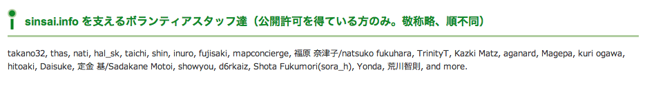

===================================
5分でわかるIPv6
===================================

- 5分でわかるIPv6 @ PyCon JP 2011

  - 2011年8月27日

  - 於 産業技術大学院大学

  - 高野光弘 /  @takano32 <tak at no32.tk>

----

お前、誰よ
----------

.. image:: takano32.jpg
  :align: left

@takano32 a.k.a. 高野光弘

- グリー株式会社 開発本部 インフラ統括部

  - サーバ群を指揮するようなツールとか作ってます

- 日本UNIXユーザ会

  - 同年代から「暗黒UNIXおじさん」と呼ばれる

- Rubyコミッタ / IA-64メンテナ

  - 前職ではIA-64やAMD64やIntel64を対象にした仮想計算機機構を作ってた

  - IA-64でRuby 1.9.3のFiber#resumeが落ちるのはぼくのせいです

----

お前、誰よ
----------

sinsai.info
^^^^^^^^^^^

開発リーダー
^^^^^^^^^^^^

 
協賛

----

お前、誰よ
----------

エキスパートPython
^^^^^^^^^^^^^^^^^^

- @t2y に誘われて査読

  - すみっこにちょろっと名前が載っています

----

今日のアジェンダ
----------------
IPv6の暗黒面とかの話をします

- ネットワーク屋の常識とソフトウェア屋の常識

  - ソフトウェアエンジニアが「ギャー」ってなる例とか紹介します

- IPv6の仕様については最低限しか触れません

  - 5分でIPv6の仔細を理解できたらすごすぎ

  - 対象者は「あー、IPv4のグローバルアドレスなくなるんだ？」くらいからで

ヤバイよ、という概要説明するカンジ

----

復習: インターネットの恐ろしさ
------------------------------

IPv6の前にIPv4もコワイ

ex. 127.0.0.1 / ループバックアドレス

- 自身のIPアドレスであるらしい

  - 「みんなそう指定してるから指定してる」でしょ？

  - それ正しいんです

- 現在では 127.0.0.0/8 という説が有力

  - つまり、 127.x.y.z でよいという説が有力

- ping 127.16.32.64

  - Linux / 0% packet loss

  - Darwin / **100% packet loss**

日常的に使っているものもよくわからない

----

アドレス表記
------------

ex. リンクローカルアドレス

- IPv4ではよくわかんないが勝手に 169.254.0.0/16 とか割り当てるやつの正式名称

..
  - IPv6ではメインの通信というより、アドレスの自動設定や近隣探索に利用
  
     - 「プライベートアドレス」の利用が氾濫し、現状と変化しない使い方を懸念
  
     - 「プライベートアドレス」という概念は現在では廃止されている

- とりあえずIPv6機構が有効になっていれば単一のマシンで使える

  - Mac とかなら手元で ifconfig すればすぐに使える

  - 今回はこのアドレスを例にアドレス表記などについておさらい

----

アドレス表記 (Contd.)
---------------------

- IPv4 リンクローカルアドレス

  - 169.254.0.0/16

- IPv6 リンクローカルアドレス

  - fe80::/10

    - ex. fe80::C0FF:EE

    - 続きはRFC 1884で

- ところで、みなさん http://192.168.32.16/ とかアクセスしますよね

  - IPv6ではどう書くんでしょうか？

    - 基本はサイトローカルアドレスと同じです

    - see also RFC 5156 `2.3. IPv4-Compatible Addresses`

----

アドレス表記 (Contd.)
---------------------

正解とポイント

- http://[fe80::01%en0]:8080/

  - コロン区切り表記に由来してポート番号がわからなくなるので [] が必要

  - インターフェイスを指定しないと行き先がわかんない / 続きはRFC 1884で

- ゾーンの扱いが難しい / ゾーンというのは上記では `en0` の部分

  - **ゾーンを指定しないと行き先が分からない**

  - **コマンドによってゾーンの扱いはことなる**

- ブラウザだとインターフェース指定がない

 - 起動するたびに **-i eth0** とか指定するブラウザがあったらキモイ

 - http://[fe80::01%en0]:8080/ のようなURL指定になる

 - **そんな不思議なURLで大丈夫か？**

----

User Agentのまとめ
------------------

================ ====================================
User Agent       IPv6 linklocal address Ready?
================ ====================================
wget             NG
w3m              NG
Lynx             OK!
Opera  11.50     NG
Chrome dev       NG
Chrome canary    NG
Firefox 5.0.1    OK!
================ ====================================

- w3m vs. lynx

  - 国内からコミットの多いw3mがコケてる

- Firefoxがんばってる

  - 探すと Host: ヘッダーに関する議論もフォーラムでしてる

- Chr*meェ・・・

  - IPv6にしても困らないって声を大にして言ってるところのブラウザ

  - なんだよ、ウソじゃん、困るやんけ・・・

もはや **疑心暗鬼になるレベル**

----

不正なアドレス 2.0
------------------

.. image:: opera.png

ネットワーク屋が得意なプロトコルスタックを改修してもムダ。

ソフトウェア屋の対応が必要。 レイヤーが複雑なWebアプリケーションは悲惨。

----

ex. PHP powered by Zend Engine
------------------------------

我らがPHPでURIをパースしてみた

::

  takano32% php -v
  PHP 5.3.6 (cli) (built: Jun  3 2011 16:17:53) (DEBUG)
  Copyright (c) 1997-2011 The PHP Group
  Zend Engine v2.3.0, Copyright (c) 1998-2011 Zend Technologies

::

  takano32% php -r 'var_dump(parse_url("http://[fe80::1%en0]:7890/"));'
  array(4) {
    ["scheme"]=>
    string(4) "http"
    ["host"]=>
    string(13) "[fe80::1%en0]"
    ["port"]=>
    int(7890)
    ["path"]=>
    string(1) "/"
  }

- ソース読んでないけど、これは実装が適当すぎる例ですね

  - host は [] が取り除かれないと他の用途で使えません

----

ex. Sinatra powered by Ruby
---------------------------

Sinatra / sinatra / lib / sinatra / base.rb

  https://github.com/sinatra/sinatra/blob/master/lib/sinatra/base.rb

:: 

  takano32% date
  Tue Jul 26 23:45:54 JST 2011

たぶん今も同じコード

.. code-block:: ruby

    set :run, false                       # start server via at-exit hook?
    set :running, false                   # is the built-in server running now?
    set :server, %w[thin mongrel webrick]
    set :bind, '0.0.0.0'
    set :port, 4567

えっ・・・ちょっとなんかすごいのがチラついた・・・

.. code-block:: ruby

    set :bind, '0.0.0.0'

IPv6というものは **アウト・オブ・眼中** という例

- IPv4の10進数表記をやめて、 set :bind, nil で対応できる

- っていうか、 **放置してればIPv6でも使えるのに** 余計なことしてる・・・

----

他人ごとではない
----------------

突撃、隣のライブラリ・フレームワーク！

IPv6 Readyなんでしょうか

- urlparse

- SimpleHTTPServer

- Django

- Flask

----

urlparse
--------

.. code-block:: python

  #!/usr/bin/env python
  import pprint
  pp = pprint.PrettyPrinter(indent = 4)
  
  from urlparse import urlparse
  
  result = urlparse('http://[fe80::1%en0]:7890/')
  print pp.pformat(result)
  print 'hostname: ' + result.hostname
  print 'port:     ' + str(result.port)

出力結果は以下の通り

::

  ParseResult(scheme='http', netloc='[fe80::1%en0]:7890',
    path='/', params='', query='', fragment='')
  hostname: fe80::1%en0
  port:     7890
  
予想外にもhostnameとportがパースできている！

これは好感触

----

SimpleHTTPServer
----------------

python -m SimpleHTTPServer 8000

::

  takano32% python -m SimpleHTTPServer 8000
  Serving HTTP on 0.0.0.0 port 8000 ...

0.0.0.0 を指定してバインドしてる・・・

ソースコードを読んでみましたがガッツリ **0.0.0.0** って書いてありました

----

Django
------

- Django

  - https://www.djangoproject.com/

::

  % python manage.py runserver
  Validating models...
  
  0 errors found
  Django version 1.3, using settings 'djangosite.settings'
  Development server is running at http://127.0.0.1:8000/
  Quit the server with CONTROL-C.

- 127.0.0.1ェ・・・

  - しょうがないのでソースコードを読んでみる

----

Django
------

BaseRunserverCommand class
^^^^^^^^^^^^^^^^^^^^^^^^^^

core/management/commands/runserver.py

.. code-block:: python

    def handle(self, addrport='', *args, **options):
        self.use_ipv6 = options.get('use_ipv6')
        if self.use_ipv6 and not socket.has_ipv6:
            raise CommandError('Your Python does not support IPv6.')
        if args:
            raise CommandError('Usage is runserver %s' % self.args)
        self._raw_ipv6 = False
        if not addrport:
            self.addr = ''
            self.port = DEFAULT_PORT
        else:
            m = re.match(naiveip_re, addrport)
            if m is None:
                raise CommandError('"%s" is not a valid port number '
                                   'or address:port pair.' % addrport)
            self.addr, _ipv4, _ipv6, _fqdn, self.port = m.groups()

- 考慮はされている
  
  - BaseRunserverCommandにどうやってプロパティを設定するのか

----

Django
------

BaseRunserverCommand class
^^^^^^^^^^^^^^^^^^^^^^^^^^

BaseRunserverCommandにどうやってプロパティを設定するのか

カンでやったらできた

::

  python2.7 manage.py runserver '[::]:8080'
  Validating models...
  
  0 errors found
  Django version 1.3, using settings 'djangosite.settings'
  Development server is running at http://[::]:8080/
  Quit the server with CONTROL-C.

**IPv6で使えるようになった**

----

Flask
-----

- Flask

  - http://flask.pocoo.org/

.. code-block:: python

  #!/usr/bin/env python
  
  from flask import Flask
  app = Flask(__name__)
  
  @app.route("/")
  
  def hello():
          return "hello"
  
  if __name__ == "__main__":
          app.run()

実行

::

  % python hello_flask.py 
   * Running on http://127.0.0.1:5000/

- 127.0.0.1ェ・・・

  - しょうがないのでソースコードを読んでみる

----

Flask class
-----------

.. code-block:: python

    def run(self, host='127.0.0.1', port=5000, **options):
        """Runs the application on a local development server.  If the
        :attr:`debug` flag is set the server will automatically reload
        for code changes and show a debugger in case an exception happened.

何も考えていなさげ

.. code-block:: diff

  @@ -9,5 +9,5 @@ def hello():
          return "hello"
   
   if __name__ == "__main__":
  -       app.run()
  +       app.run('::')

host引数を与えてみた

::

  % python hello_flask.py
   * Running on http://[::]:5000/

**IPv6で使えるようになった**

..
  - Pyramid
  
    - https://docs.pylonsproject.org/projects/pyramid/1.1/index.html

----

まとめ
------

もっと生産的な意見を提示しようと思っていたんだけれど、Python界は思ったより平和でした

ただし、油断しているとIPv6は **オウト・オブ・眼中**

- **どのレイヤーで問題が起こるかわからない** ので、必要なときには専門外のソースコードにもダイブする勇気を

- 同じ問題意識を共有し、世界のサービスが「ギャー」ってならないといいですね！

  - 余裕があれば啓蒙活動をしましょう

- 今回の例は氷山の一角でIPv6が広く使われはじめたら何が起こるか分かりません

  - ネットワーク屋が言う「動く」を真に受けすぎるとやられる可能性大

  - さしあたり LSN or CGN でインターネットの「ギャー」ありそう

    - Ajax使ってるサービスはNAPTのテーブル溢れさせる可能性高い

----

宣伝
----

キネクトハッカーズマニュアル
^^^^^^^^^^^^^^^^^^^^^^^^^^^^
    

- 発売日 / 8月25日

- 定価 / 2480円+税

- @hagino3000 に誘われて査読
  
  - すみにちょろっと名前が(ry
