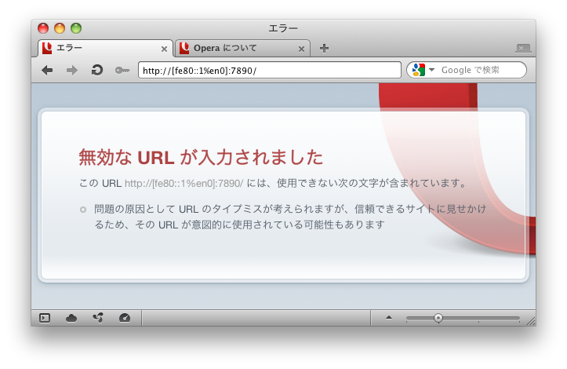

===================================
5分でわかるIPv6
===================================

- タイトルを中央にもってくる方法がわからない

  - ってか、書いてる間にプレゼンツールがデグレったっぽい

- 5分でわかるIPv6 @ PyCon JP 2011

  - 2011年8月27日
    
  - 於 産業技術大学院大学

  - 高野光弘 /  @takano32 <tak at no32.tk>

----

お前、誰よ
----------

@takano32 a.k.a. 高野光弘

- グリー株式会社 開発本部 インフラ統括部

  - サーバ群を指揮するようなツールとか作ってます

- 日本UNIXユーザ会

  - 理事 / 幹事のなかでは最年少のはずなんだけど・・・

  - 同年代から「暗黒UNIXおじさん」と呼ばれる

- Rubyコミッタ

  - IA-64という世にも奇妙なアーキのメンテナ

    - IA-64やAMD64やIntel64を対象にした仮想計算機機構を作ってた

    - IA-64でRuby 1.9.3のFiber#resumeが落ちるのはぼくのせいです

----

今日のアジェンダ
----------------
IPv6の暗黒面とかの話をします

- ネットワーク屋の常識とソフトウェア屋の常識

  - 剥離がおそろしい

  - いまIPv4でできてることができなくなるよ

  - ソフトウェアエンジニアが「ギャー」ってなる例とか紹介します

- IPv6の仕様については最低限しか触れません

  - 5分でIPv6の仔細を理解できたらすごすぎ

  - 対象者は「あー、IPv4のグローバルアドレスなくなるんだ？」くらいからで

ヤバイよ、という概要説明するカンジ

----

復習: インターネットの恐ろしさ
------------------------------

IPv6の前にIPv4もコワイ

ex. 127.0.0.1 / ループバックアドレス

- 自身のIPアドレスであるらしい

  - 「みんなそう指定してるから指定してる」でしょ？

  - それ正しいんです
  
- 現在では 127.0.0.0/8 という説が有力

  - つまり、 127.x.y.z でよいという説が有力

- ping -c 127.16.32.64

  - Linux / 0% packet loss

  - Darwin / 100% packet loss

日常的に使っているものもよくわからない

----

アドレス表記
------------

ex. リンクローカルアドレス

- IPv4ではよくわかんないが勝手に 169.254.0.0/16 とか割り当てるやつの正式名称

- IPv6ではIPv4のプライベートアドレスのように使ったりする

   - 元々の意味はブロードキャストセグメントの通信に使えるアドレス

----

アドレス表記 (Contd.)
---------------------

- IPv4 プライベートアドレス

  - 10.0.0.0/8 or 172.16.0.0/12 or 192.168.0.0/16

- IPv6 リンクローカルアドレス

  - fe80::/10

  - 続きはRFC 1884で

- ところで、みなさん http://192.168.32.16/ とかアクセスしますよね

  - IPv6ではどう書くんでしょうか？

  - 今回はリンクローカルアドレスについて考えてみよう

    - see also RFC 5156 `2.3. IPv4-Compatible Addresses`

----

アドレス表記 (Contd.)
---------------------

正解とポイント

- http://[fe80::01%en0]:8080/

  - コロン区切り表記に由来してポート番号がわからなくなるので [] が必要

  - インターフェイスを指定しないと行き先がわかんない

    - これも続きはRFC 1884で

- ネットワーク屋の主張

  - DNSでAAAAを引けば生のアドレス打たなくていいじゃーん

  - 問題が起きないっていうデータの裏付けも取れてるよ！

    - ex. World IPv6 Day

でも、それはユーザの視点。開発者はヤバイ。

192.168.32.16 使えないと困るよね。

----

User Agentのまとめ
------------------

================ ====================================
User Agent       IPv6 linklocal address Ready?
================ ====================================
wget             NG
w3m              NG
Lynx             OK!
================ ====================================

- 意外だったのは w3m vs. Lynx

  - w3mのほうがユーザ数多い気がする
    
  - メンテナも多い気がする

  - それ以上に国産！

    - IPv6には日本からかなりのコミットがある

  - Lynxのほうは元から仕様に忠実な実装してたのかなぁ？

とりあえず、 **よくわかんないことはわかった**

はい、つぎの User Agent いきましょう

----

User Agentのまとめ 2.0
----------------------

================ ====================================
User Agent       IPv6 linklocal address Ready?
================ ====================================
Opera  11.50     NG
Chrome dev       NG
Chrome canary    NG
Firefox 5.0.1    OK!
================ ====================================

- Firefoxがんばってる

  - 探すと Host: ヘッダーに関する議論もフォーラムでしてる

- Chr*meェ・・・

  - IPv6にしても困らないって声を大にして言ってるところのブラウザ

  - なんだよ、ウソじゃん、困るやんけ・・・

もはや **疑心暗鬼になるレベル**

----

不正なアドレス 2.0
------------------

ネットワーク屋が得意なプロトコルスタックを改修してもムダ。

ソフトウェア屋の対応が必要。 レイヤーが複雑なWebアプリケーションは悲惨。

----

ex. 言語処理系
--------------

我らがPHPでURIをパースしてみた

::

  takano32% php -v
  PHP 5.3.6 (cli) (built: Jun  3 2011 16:17:53) (DEBUG)
  Copyright (c) 1997-2011 The PHP Group
  Zend Engine v2.3.0, Copyright (c) 1998-2011 Zend Technologies

::

  takano32% php -r 'var_dump(parse_url("http://[fe80::1%en0]:7890/"));'
  array(4) {
    ["scheme"]=>
    string(4) "http"
    ["host"]=>
    string(13) "[fe80::1%en0]"
    ["port"]=>
    int(7890)
    ["path"]=>
    string(1) "/"
  }

- ソース読んでないけど、これは実装が適当すぎる例ですね

  - host は [] とゾーンが取り除かれないと他の用途で使うときはダメ

- Rubyはちょっとだけ、ほんとにちょっとだけマシ？考えようによっては劣ってる

  - URI::InvalidURIError という例外が発生する

----

ex. フレームワーク
------------------

Sinatra / sinatra / lib / sinatra / base.rb

  https://github.com/sinatra/sinatra/blob/master/lib/sinatra/base.rb

:: 

  takano32% date
  Tue Jul 26 23:45:54 JST 2011

たぶん今も同じコード

.. code-block:: ruby

    set :run, false                       # start server via at-exit hook?
    set :running, false                   # is the built-in server running now?
    set :server, %w[thin mongrel webrick]
    set :bind, '0.0.0.0'
    set :port, 4567

えっ・・・ちょっとなんかすごいのがチラついた・・・

.. code-block:: ruby

    set :bind, '0.0.0.0'

IPv6というものは **アウト・オブ・眼中** という例

- IPv4の10進数表記をやめて、 set :bind, nil で対応できる

- っていうか、 **放置してればIPv6でも使えるのに** 余計なことしてる・・・

----

他人ごとではない
----------------

.. code-block:: python

  import SimpleHTTPServer
  import SocketServer
  
  PORT = 8000
  
  Handler = SimpleHTTPServer.SimpleHTTPRequestHandler
  
  httpd = SocketServer.TCPServer(("", PORT), Handler)
  
  print "serving at port", PORT
  httpd.serve_forever()

SimpleHTTPServerを起動

::

  takano32% python httpd.py 
  serving at port 8000

----

他人ごとではない
----------------

python -m SimpleHTTPServer 8000

::

  takano32% python -m SimpleHTTPServer 8000
  Serving HTTP on 0.0.0.0 port 8000 ...

0.0.0.0 を指定してバインドしてる・・・

----

他人ごとではない
----------------

- DJango

- flask

- Pylamid

----

FAQ
---

なんであなたはチケット切ったり修正しないんですか

- @takano32 はクラウドシステムのようにスケールしません...orz

- 影響プロダクトが無数

  - FTPとかもNAPTでブッ壊れるんじゃないかなー

    - っていうか、たぶんip_conntrack_ftpとip_nat_ftpで壊れる
      
    - FTPとかソフトウェア屋にとってはロステク
        
    - でも各所のWebデザインが「ギャー」するのかなー

  - **#IPv6あるある** くらいには「ギャー」ってなると思う

- できるのは啓蒙活動くらい

- Rubyまわりくらいは余裕があればなおします

  - CRubyは処理系周りのコミット権あるし、折衝しやすい

----

まとめ
------

- **どのレイヤーで問題が起こるかわからない** ので、必要なときには専門外のソースコードにもダイブする勇気を

- 同じ問題意識を共有し、世界のサービスが「ギャー」ってならないといいですね！

  - そして、余裕があれば啓蒙活動をしましょう

- 今回の例は氷山の一角でIPv6が広く使われはじめたら何が起こるか分かりません

  - ネットワーク屋が言う「動く」を真に受けすぎるとやられる可能性大

  - さしあたり LSN or CGN でインターネットの「ギャー」ありそう

    - 超大雑把に言うとバカでかいNAPT作りましたってヤツです
      
    - Ajax使ってるサービスはNAPTのテーブル溢れさせる可能性高い

----

おしまい
--------

- ご清聴ありがとうございました

- 宣伝

  - LL Planets の IPv6ハッカソン で登壇します

    - http://ll.jus.or.jp/2011/program/ipv6hackathon.html
        
      - 絶賛登壇者募集中

        - LL Planets実行委員もやってる

        - ぼくと契約して(ry

    - チケット買っていただけると実行委員一同歓喜

      - 最速ほげふが研究会のマラもくるのでたぶん楽しい

  - PyCon JP 2011 でも登壇します <= NEW

----

おまけ：あなたの IPv6 レベル
----------------------------

独断と偏見

#. "IPv6"という文字列
#. IPv4 と IPv6 の存在
#. IPv4 のIPアドレスが少ない
#. IPv4 のグローバルアドレスが枯渇した
#. IPv4 のアドレスは32ビットで IPv6 のアドレスは 128ビット
#. IPv6 のアドレス表記
#. AAAA レコードの存在
#. アドレス空間の分け方
#. IPv4ヘッダとIPv6ヘッダの違い
#. アドレス空間が腐っても平気な回数

